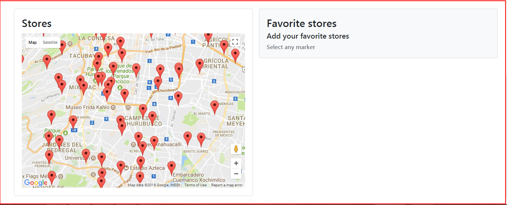
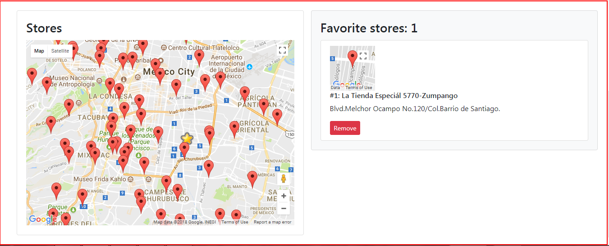

React.js Assignment
===================

Following points are to be noticed regarding the solution provided
* As the addresses given _store_directory.json_ doesn't contain _longitude_ and _latitude_ therefore used __Google APIs__ to convert those addresses to co-ordinates and stored in _locations.json_ file and used it in the app instead of _store_directory.json_.
* Used _bootstrav4.0_ for styling.
* Didn't use _redux_ as it was told not to in order to maintain the simplicity of the app.

---

### Running the app
1. run `yarn install` or `npm install` (_to install dependencies_)
2. run `yarn start` or `npm start` (_to run the app at http://localhost:3000_).

---

### Following are some screenshots of the app

